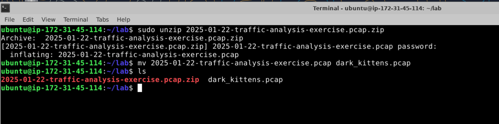
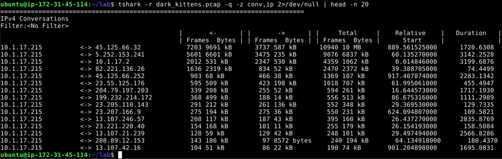
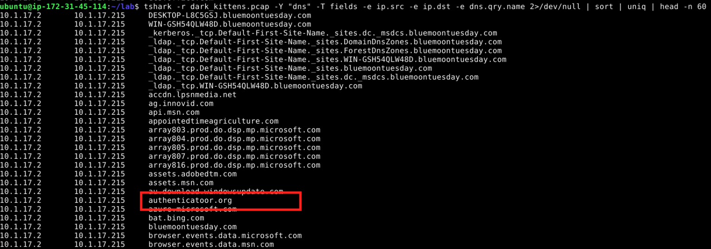
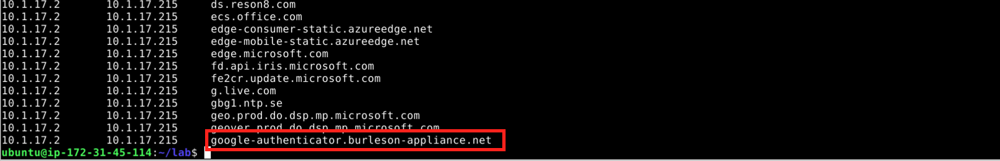
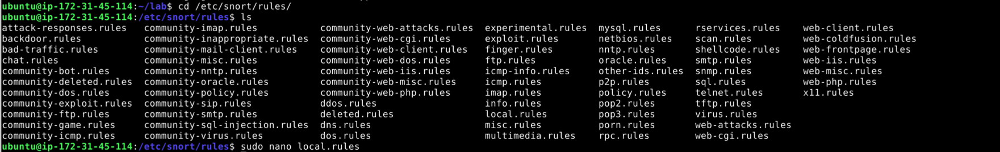
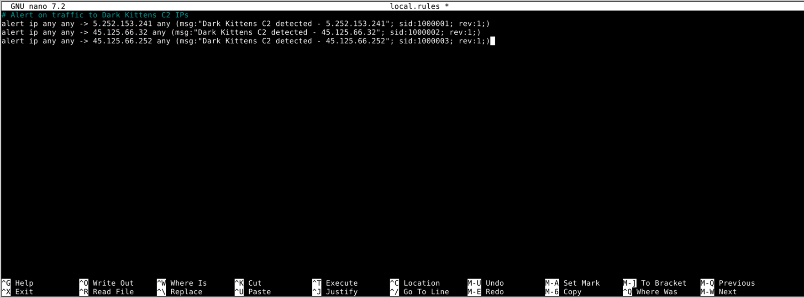
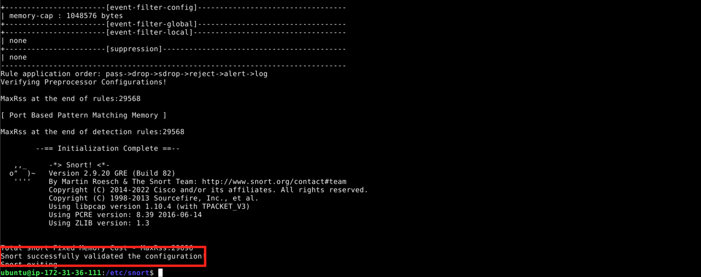

# Operation Cat Trap 

**Role:** Globomantics SOC Analyst  
**Goal:** Identify and alert on malicious activity in a Dark Kittens attack using a PCAP and Snort

## Situation: 
Globalantics experienced a spike in help desk tickets yesterday. Several employees reported that their browsers redirected them to a fake software update page, after which their systems began acting strangely.

The SOC lead believes the **Dark Kittens** may be behind this. A network sensor captured traffic during one of these incidents. You’ve been tasked to:

1. **Prepare** the received zipped packet capture for analysis. 
2. **Triage** the packet capture for initial indicators using `tshark`.
3. **Identify** suspicious domains or C2 IPs.
4. **Deploy** a custom Snort rule to detect future attacks of the same type.

### **Step 1 - Prepare for Triage**

**Story:** The packet capture is too large, and it keeps crashing Wireshark. So, we need to do some analysis with the command line version of Wireshark, known as `tshark`. 

Our first goal is to spot odd patterns in traffic that might point to the Dark Kittens infrastructure. Let's begin by navigating to `/home/ubuntu/lab` with the command:
```bash
cd /home/ubuntu/lab
```

There is a zipped `.pcap` in there for us, so we need to unzip it first:
```bash
sudo unzip 2025-01-22-traffic-analysis-exercise.pcap.zip
```

The password it prompts for is `infected_20250122`. 

We now have the pcap extracted, lets rename it to make it easy by doing a
```bash
mv 2025-01-22-traffic-analysis-exercise.pcap dark_kittens.pcap
```

If we run the `ls` command, we can see our `dark_kittens.pcap` file is ready for analysis. 
   

---
### **Step 2 — First Pass with `tshark`: Top Talkers**

As we dive into the network traffic captured in `dark_kittens.pcap`, the first step is to identify the most active hosts communicating with our internal Globomantics network. Run the following command:
```bash
tshark -r dark_kittens.pcap -q -z conv,ip 2>/dev/null | head -n 20
```

- `-r dark_kittens.pcap` ->  Read from the PCAP file we downloaded.
- `-q` ->  Run in “quiet” mode so only statistics are printed, not individual packets.
- `-z conv,ip` ->  Generate an **IP conversation summary**, showing which hosts talk to each other, how many frames and bytes were exchanged, and the duration.
- `2>/dev/null` ->  Suppress warnings or errors from Tshark (like dissector warnings).
- `| head -n 20` ->  Limit the output to the first 20 lines for readability.



Using the Tshark IP conversation summary, we can see that the internal host **`10.1.17.215`**  is communicating heavily with a range of external IP addresses.

We also see that **45.125.66.32** and **5.252.153.241** dominate the conversation table. This pattern immediately raises suspicion. We have large outbound transfers that could indicate exfiltration of sensitive information, perhaps orchestrated by the Dark Kittens. 

Mapping these “top talkers” gives us the initial view of where to focus our defensive measures, highlighting which sessions might warrant deeper packet inspection and eventual Snort alert rules.

---
### **Step 3 — Identify Suspicious DNS Queries**

Now we have an update from the SOC lead:

 “**If they went to a fake site, it’ll be in the DNS logs inside that PCAP file your analyzing. See if you can pull those queries and we can check them against threat intelligence report the team is working on**"

Our next step is to investigate **which domains the internal host is querying**. Using `tshark` to extract DNS queries from `dark_kittens.pcap`, we start to see a mix of normal corporate traffic and some unusual domains. While many queries go to expected services, several others are unfamiliar and occur repeatedly. This hints at potential **malware command-and-control activity**, as Dark Kittens may be attempting to communicate with external servers or exfiltrate data.

```bash
tshark -r dark_kittens.pcap -Y "dns" -T fields -e ip.src -e ip.dst -e dns.qry.name 2>/dev/null | sort | uniq | head -n 60
```

- `-r dark_kittens.pcap` ->  Read packets from the PCAP file.
- `-Y "dns"` ->  Filter to show only DNS packets.
- `-T fields` ->  Output specific fields instead of the full packet details.
- `-e frame.number` ->  Packet number.
- `-e ip.src` ->  Source IP of the packet.
- `-e ip.dst` ->  Destination IP.
- `-e dns.qry.name` ->  The queried domain name.
- `sort | uniq` ->  Sort the output and remove duplicate entries so you see only **unique DNS queries**.
- `head -n 60` ->  Limit the output to the first 60 lines for readability.

While there are a lot of results to sift through, we can see that there are a few that stand out. 

**authenticatoor.org**


**google-authenticator.burleson-appliance.net**

---
### **Step 4- Prepare for Triage**

Passing along the what we found, the SOC lead confirms those DNS queries were identified in the threat intelligence report. The report also indicated that the C2 servers associated with those domains were ones previously identified in our top talkers section: 
- `5.252.153.241`
- `45.125.66.32
- `45.125.66.252`

These are the hosts we want Snort to monitor. Snort rules are usually stored in `/etc/snort/rules/` or `/etc/snort/rules/local.rules`. Let's navigate to the directory to update our rule file. 

Run: 
```bash
cd /etc/snort/rules
sudo nano local.rules
```


Inside the local.rules, we want to paste the following. 
```bash
##Alert on traffic to Dark Kittens C2 IPs
alert ip any any -> 5.252.153.241 any (msg:"Dark Kittens C2 detected - 5.252.153.241"; sid:1000001; rev:1;)
alert ip any any -> 45.125.66.32 any (msg:"Dark Kittens C2 detected - 45.125.66.32"; sid:1000002; rev:1;)
alert ip any any -> 45.125.66.252 any (msg:"Dark Kittens C2 detected - 45.125.66.252"; sid:1000003; rev:1;)
```
In a Snort rule, each component serves a specific purpose. The `alert ip any any -> <IP> any` portion tells Snort to monitor **all IP traffic from any source to the specified target IP on any port**, ensuring no communication to the malicious host goes unnoticed. The `msg` field provides a custom message that we can modify that will appear in the alert output, helping us to  quickly understand what triggered the rule. Every rule requires a unique Snort ID (`sid`) so that it can be referenced and managed independently, while the `rev` field represents the **revision number** of the rule, allowing you to track updates or changes over time. 



To save our changes we enter `Control + X` to exit, type `Y` to confirm saving our newly written snort rules, and `enter`.

With our custom Snort rules in place for the Dark Kittens C2 IPs, we now verify that our defensive measures are effective. By running Snort in PCAP mode against `dark_kittens.pcap`, any attempts by the internal host to communicate with the identified C2 IPs (`5.252.153.241`, `45.125.66.32`, `45.125.66.252`) will trigger alerts directly in the console. First, were going to create a quick custom snort.conf file for testing purpose, so we don't test against all the snort rules in the system.

```bash
sudo nano /etc/snort/snort_local.conf
```


Inside the snort_local.conf, we'll include the bare minimum:
```bash
###########################################################################
# Minimal Snort configuration for testing only local.rules
###########################################################################

# Step 1: Setup basic paths
var RULE_PATH /etc/snort/rules

# Step 2: Include only local.rules
include $RULE_PATH/local.rules

# Step 3: Output configuration
output alert_fast: stdout
```
Ensure to save just like we did previously with `Control + X`, `Y`, and `enter`. 


Now lets have snort validate our configuration file to check for errors:
```bash
sudo snort -T -c /etc/snort/snort_local.conf
```

If all goes well, you should see a successful message:


Now we need to test our rules we created against the `dark_kittens.pcap`:
```bash
sudo snort -c /etc/snort/snort_local.conf -r /home/ubuntu/lab/dark_kittens.pcap -q -A fast
```
- `-c /etc/snort/snort_local.conf` -> Uses your minimal config.
- `-r /home/ubuntu/lab/dark_kittens.pcap` -> Reads packets from the PCAP
- `-q` -> Quiet mode, suppresses startup banner
- `-A fast`-> Prints only alert messages, no full packet dump.


Successfully seeing these alerts gives us confidence that our rules are functioning correctly.
